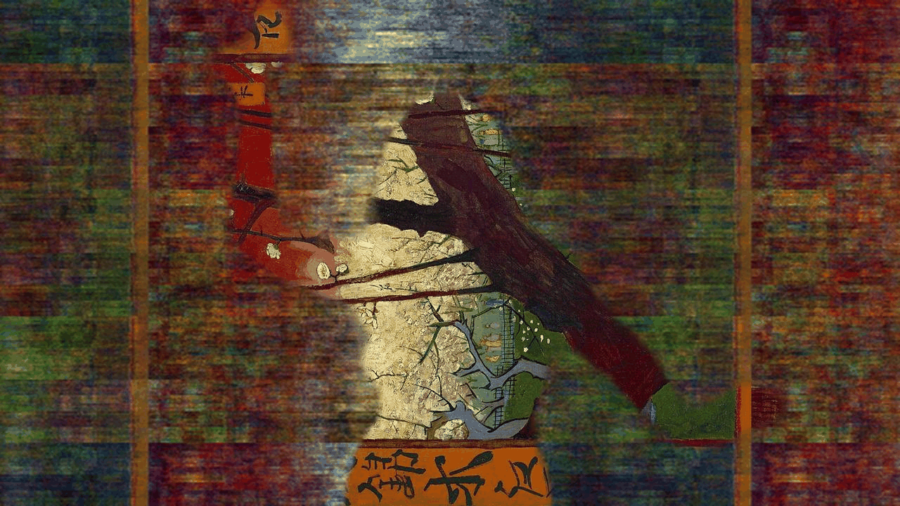
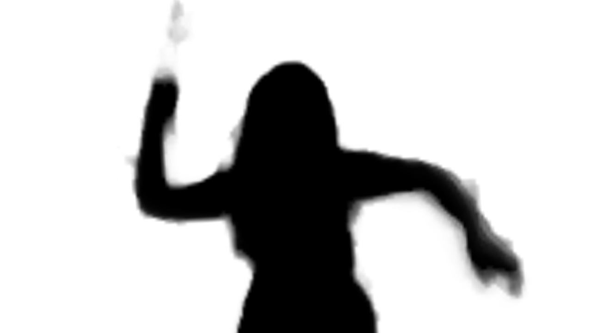
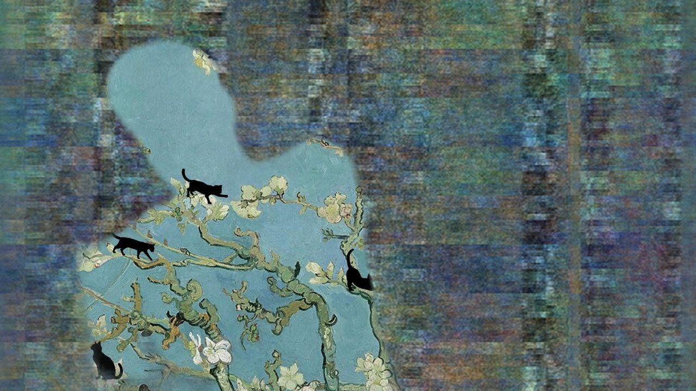

# Telablur dance

Let's make some art. 

And maybe count some cats.

**[telablur-dance.netlify.app](https://telablur-dance.netlify.app/)**

Move in front of your camera; your silhouette serves as a mask, and ten quick captures turn into a gif. 

Example of a motion capture mask:

## Two modes

- **Find the cats** — a hidden picture game. Move around to reveal more of the canvas. How many cats can you spot?
   
- **Make your own** — upload two images of your own, dance, and create a gif.

There's an [image library](https://bit.ly/telablurdancelibrary) you can pull from if you don't have any images handy.

## About the images

Two images are blended using Moth Quantum's [Telablur Engine](https://platform.mothquantum.com/engines/showcase/telablur).

"Telablur places two images inside a single quantum state and morphs between them through rotation rather than blending. The result looks nothing like a crossfade — at half strength the effect reaches its peak, with both images blurring into each other at once, their shapes tangled by quantum interference across the whole register."

You have two orientation options, landscape (16:9, 1280x720) or portrait (9:16, 720x1280).

## You'll need a Moth Quantum API key

Grab one from the [Moth Quantum dashboard](https://platform.mothquantum.com/). Go to API keys and click 'Create new key'. 
Paste it in where the app asks. It stays in your browser tab only, never saved or sent anywhere else (except to the Moth platform).

## Early days

This is still early stage, so something may break or act weird. If it does, let me know.

## Share what you make

[We wanna see your gifs!](https://bit.ly/telablurdance).

Submit as many as you like. We wanna compile them into a music video!

And if you use the "find the cats" mode, tell us how many cats you found.
